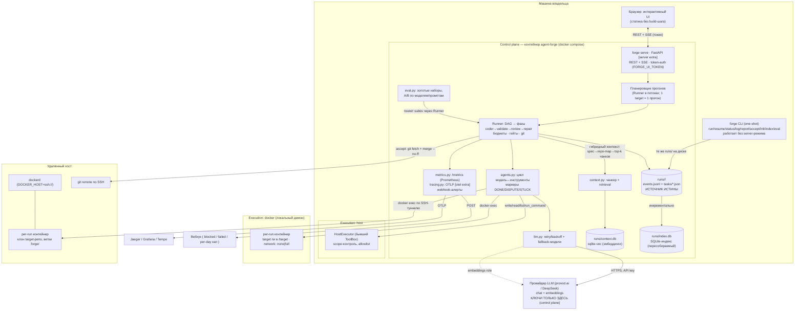

# Целевая архитектура agent-forge: диаграмма и поэлементная работа

Дата: 2026-08-21 · Состояние «после v2+v3» (волны tasks.v2.yaml + tasks.v3.yaml) · Основание: [ARCH_TARGET.ru.md](ARCH_TARGET.ru.md), [GAP_ANALYSIS.ru.md](GAP_ANALYSIS.ru.md), DECISIONS AF-14..17

## Диаграмма

## Как работает каждый элемент

### 1. CLI (существует, не меняется)

`forge run/resume/status/log/report/accept/import` — one-shot процесс: загрузил `tasks.yaml` → построил DAG → прошёл задачи → завершился. Состояние целиком в `runs/` — kill безопасен, `resume` продолжает со снапшотов истории (AF-08/AF-12). Добавляются команды: `init` (v2-t3: scaffolding целевого проекта), `stop` (v2-t4: маркер `runs/<id>/STOP`), `index` (v3-f1: построение векторного индекса), `eval` (v3-g1), `reindex` (v3-d1), `serve` (v3-a1). CLI и server — два входа к одним механизмам и одним журналам; CLI обязателен для CI и отладки (AF-14).

### 2. forge serve — HTTP-слой (v3-a1/a2)

FastAPI-процесс (опциональный extra `[server]`, ядро остаётся stdlib-only, AF-15). На старте поднимает read-эндпоинты из существующего `ui.py` без смены контракта. Auth: если задан `FORGE_UI_TOKEN` — middleware требует `Authorization: Bearer <token>`; bind по умолчанию `127.0.0.1` (публикация наружу — осознанное действие владельца через compose-порты). Сервер **никогда не правит журналы через read-API**; мутации — только три осмысленные: создать STOP-маркер, записать accept-факт, стартовать прогон (создаёт новый `runs/<id>/`).

### 3. Планировщик (v3-a2, d2)

`POST /api/runs` → Runner в daemon-потоке. Инвариант: один активный прогон на target-репозиторий (409 при конфликте) — защита от двух процессов, пишущих в один git. Прогоны разных репозиториев параллельны (d2). Планировщик не держит состояния в памяти, которого нет на диске: рестарт сервера = потерянные потоки, прогоны добиваются через `resume` (см. список ошибок E4).

### 4. Runner (существует; эволюция в v2-t4, v3-c1)

Для каждой задачи DAG: проверка гейтов (ожидание `accept` предыдущей gated-задачи) → проверка бюджетов (per-task/run/day; per-day через SQLite-индекс после d1) → проверка STOP-маркера → ветка `forge/<task-id>` → coder-цикл → acceptance → reviewer → repair ≤3 → commit после APPROVE. Все события — в журнал. Каждая точка принятия решения журналируется: именно это делает возможными и UI-стадии, и evals, и метрики — они читают один и тот же поток событий.

### 5. agents.py — цикл модель↔инструменты (существует)

Модель получает system-промпт роли + промпт задачи и вызывает инструменты, пока не вернёт маркер. Маркеры — контракт честности: `DONE` (переход к валидации), `BLOCKED`/`GAP` (стоп с причиной), `DISPUTE` (противоречие спеки — решает человек), `STUCK` (repair не смог), `STEPS_EXHAUSTED` (защита от зацикливания). После v3-c1 инструменты делегируют в Executor, а не в файловую систему напрямую — с точки зрения модели ничего не меняется.

### 6. llm.py (существует; +роль embedder в v3-f1)

OpenAI-совместимый клиент: экспоненциальный backoff на 429/5xx, fallback-модели пресета, учёт токенов/стоимости в журнал по ценам `config/models.yaml`. Роль `embedder` — тот же клиент против `/v1/embeddings`. MockClient детерминирован — весь CI без ключа (NFR/§6.3).

### 7. Executor-протокол (v3-c1) — сердце исполнения

Единый интерфейс `write_file / read_file / list_dir / run_command / run_acceptance`. Scope-контроль и deny-паттерны (npm install и т.п.) живут в общем базовом слое — они применяются **до** транспорта, одинаково для всех исполнителей. Три реализации:

- **HostExecutor** — текущее поведение (рефакторинг ToolBox, регрессионный acceptance — все существующие тесты зелёные).
- **DockerExecutor** (v3-c2) — per-run контейнер из `executor.image`, target смонтирован rw в `/target`, `docker exec` для команд, network-политика `none|full`. Нет демона → варнинг в журнал + host-режим.
- **RemoteDocker** (v3-c3) — тот же DockerExecutor с `DOCKER_HOST=ssh://user@host` (AF-17): вся механика переиспользуется, меняется только endpoint демона. В контейнер не передаются env с `*_API_KEY` (проверяется тестом).

### 8. Git при remote-исполнении (v3-c3, AF-16)

Клон целевого репо живёт на удалённом хосте; ветки и коммиты `forge/<id>` создаются там. `forge accept` добавляет хост как git remote (SSH), делает `fetch forge/<id>` и merge `--no-ff` локально. NFR-5 сохранён: push не выполняется никогда, fetch — pull-направление.

### 9. Журналы runs/ (существует) — источник истины

`run.json` (модели, prompts_version, провайдер, mock-флаг), `events.jsonl` (каждый вызов модели, команда, токены, стоимость), `tasks/<id>.json` (состояния, repair-счётчик), снапшоты истории. Всё остальное — производные: UI, индекс, метрики читают журналы; индекс пересобираем (`forge reindex`).

### 10. SQLite-индекс (v3-d1)

`runs/index.db`: runs/tasks/агрегаты событий/costs. Инкрементальное обновление по mtime журналов; полная пересборка из журналов. `status/report` и UI читают индекс, если он свежий; иначе — прямое чтение файлов (текущий путь). per-day кап через индекс — конец полного обхода всех events.jsonl на каждой проверке.

### 11. Контекст и retrieval (v3-f1/f2)

`forge index` чанкует файлы scope + docs целевого репо (~1–2K символов, границы по заголовкам/сигнатурам), эмбеддит ролью `embedder`, пишет в `runs/context.db` (sqlite-vec), инкрементально по хешу файла. В промпт coder'а: spec-excerpt → repo-map (v2-t8) → top-k чанков по тексту задачи (k и лимит в конфиге). Каждое попадание чанка журналируется (`phase=context`, путь+score). Mock-embedder — детерминированный хеш-вектор: CI без ключа. sqlite-vec не установлен → retrieval молча отключается с варнингом, инструмент работает как раньше.

### 12. Промпты (существует; +метаданные в v3-f2)

`prompts/*.md` git-версионируются; версия (git hash / sha256) пишется в run.json (FR-7). Front-matter (назначение, changelog) парсится `prompts.py`. Правка промпта → новая версия → сравнимые результаты в evals.

### 13. Evals (v3-g1/g2)

`forge eval --suite NAME`: фикстуры мини-репо + задачи с известным исходом, включая ловушки (противоречие → ждём DISPUTE; выход за scope → ждём блок). Результат в `runs/evals/<id>/`: pass rate, repair-итерации, стоимость, доля корректных отказов. `forge eval compare A B` — дельта-таблица с атрибуцией к моделям/prompts_version из run.json. Mock-suite — гейт в CI. Ничего не публикуется (AF-13): это приватный контур качества владельца.

### 14. Наблюдаемость (v3-h1/h2)

`/metrics` (Prometheus text, stdlib-рендер): токены/стоимость по ролям и моделям, длительность фаз, repair rate, blocked/failed rate, utilization капов. Опциональный `[otel]` extra: trace=прогон, span=фаза задачи, экспорт OTLP в Jaeger/Grafana/Tempo; без extra — no-op. `alerts.webhook_url` — POST на blocked/failed/per-day кап.

### 15. UI (v2-t5, v3-b2)

Статика без build-шага. Сейчас: read-only kanban + журнал (meta-refresh 3s). После v2: стадии задачи (coder→validate→review→repair×N) с логами по стадии, кнопка Stop. После v3-b2: форма запуска прогона, Stop/Resume/Accept, живое обновление по SSE вместо поллинга, токен через prompt() при первом 401. После d2: multi-run dashboard из индекса.

## Найденные ошибки и пробелы (в ходе описания)

| # | Где | Проблема | Сeverity | Действие |
|---|---|---|---|---|
| E1 | `config/tasks.v3.yaml`, задача v3-h1 | Опечатка: «Стdlib-рендер» (кириллица+латиница) | trivial | исправлено в этом же коммите |
| E2 | `tasks.v2.yaml` t1 ↔ t3 | t1 требует `'forge init' in WORKFLOWS.md`, но `forge init` появляется только в t3, и зависимости нет — возможна документация несуществующей команды, если t3 упадёт | minor | поставить t1 после t3 или пометить команду в доке как «волна 2»; выбрано: оставить (документ описывает целевой UX), отмечено здесь |
| E3 | `ARCH_TARGET.ru.md` §3.5 / AF-16 | Не специфицирован **bootstrap**: как целевой репо впервые попадает на удалённый хост (push запрещён). Нужен `forge remote bootstrap` (rsync/git archive по SSH) или документированное ручное действие | **major** | новая задача в v3-очереди (v3-c3.5) — добавлена в backlog разделом ниже |
| E4 | `ARCH_TARGET.ru.md` §3.1 | Не описан рестарт server-режима с активным прогоном: поток умирает, прогон «висит» в running. Нужен startup-обход: прогоны в нефинальных состояниях → событие `run interrupted` + явная кнопка Resume в UI | **major** | дописать в спеку server-режима (входит в v3-a2 при реализации) |
| E5 | `tasks.v2.yaml` t5 ↔ `tasks.v3.yaml` b2 | Дубль работы: t5 строит стадии на поллинге, b2 перестраивает на SSE. Осознанная эволюция, но b2-спека должна явно сказать «заменяет meta-refresh из t5» — сказано только частично | minor | учесть в промпте b2 при прогоне |
| E6 | v3-h1 метрики | per-day кап и метрики читают индекс; если индекс протух — рассинхрон цифр UI и реального списания. Нужен инвариант: проверка бюджета всегда по журналам (истина), индекс — только для отображения | **major** | зафиксировано: бюджетные проверки (runner) НЕ переходят на индекс; индекс — для UI/report |
| E7 | `tasks.v3.yaml` e1 | Acceptance release.yml — только синтаксис TOML/pytest; публикация в ghcr/PyPI не проверяема без тега. Ожидаемо, но гейт wave-e должен включать ручной прогон workflow_dispatch | minor | отмечено в комментарии задачи при прогоне |

### Дополнение к backlog (из E3, E4, E6)

- **v3-c4-remote-bootstrap**: `forge remote bootstrap --host ssh://...` — доставка целевого репо на хост (git archive | ssh tar), первичный `docker build` образа на удалённом демоне, проверка связности; acceptance — тест с фейковым ssh.
- Спека server-режима: startup-обход прерванных прогонов (E4) — реализуется внутри v3-a2, отражено в комментарии задачи.
- Инвариант E6: budget-проверки читают журналы всегда; добавить тест `test_index_never_source_of_budget_truth` в v3-d1.
